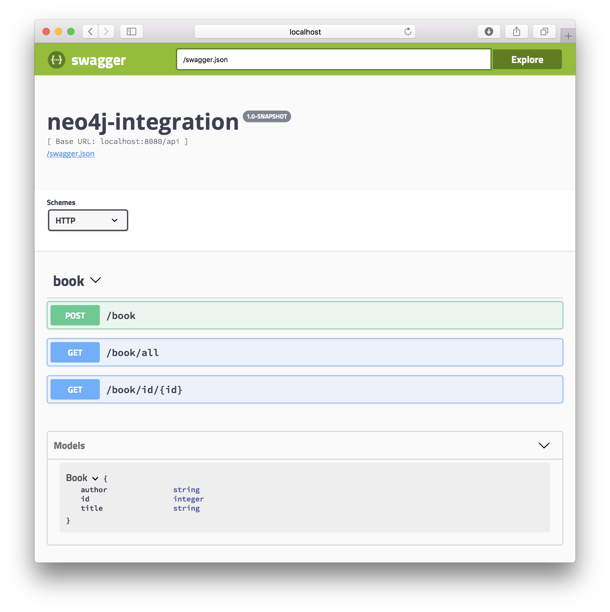
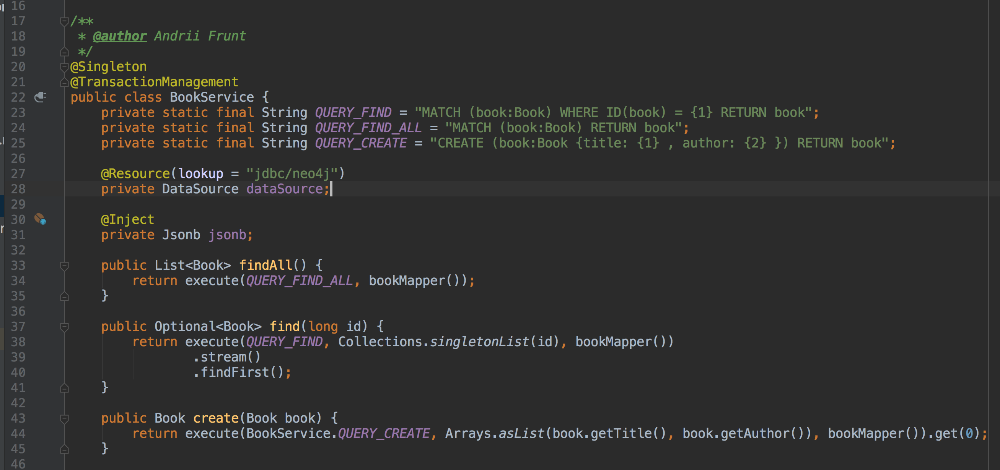

### Java EE 8 and NEO4j integration example

Example of how to integrate Java EE application with NEO4j database via JDBC.
Transactions are handled by container.

#### Setup
1. Download [neo4j-jdbc-driver](http://search.maven.org/remotecontent?filepath=org/neo4j/neo4j-jdbc-driver/3.1.0/neo4j-jdbc-driver-3.1.0.jar) and put it to your GlassFish domain lib directory.
2. Add the configuration of JDBC pool and JDBC resource to your domain.xml file's resources node.

```xml
<jdbc-connection-pool driver-classname="org.neo4j.jdbc.bolt.BoltDriver" datasource-classname="" name="jdbc/neo4jPool" res-type="java.sql.Driver">
      <property name="password" value="admin" />
      <property name="user" value="neo4j" />
      <property name="URL" value="jdbc:neo4j:bolt://localhost/?scheme=basic" />
</jdbc-connection-pool>
    
<jdbc-resource pool-name="jdbc/neo4jPool" jndi-name="jdbc/neo4j" />
```
3. Start neo4j with command
```bash
docker run --publish=7474:7474 --publish=7687:7687 --volume=$HOME/neo4j/data:/data neo4j
```
4. Open [http://localhost:7474](http://localhost:7474). Log in with neo4j/neo4j and change the password to admin
5. Build and deploy the application to your domain and open [Swagger UI](http://localhost:8080/webjars/swagger-ui/3.8.0/?url=/swagger.json)

Here is what you should see


The code looks pretty simple and straightforward
